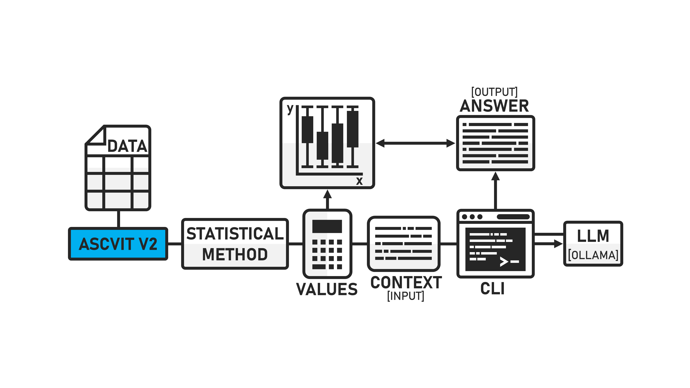
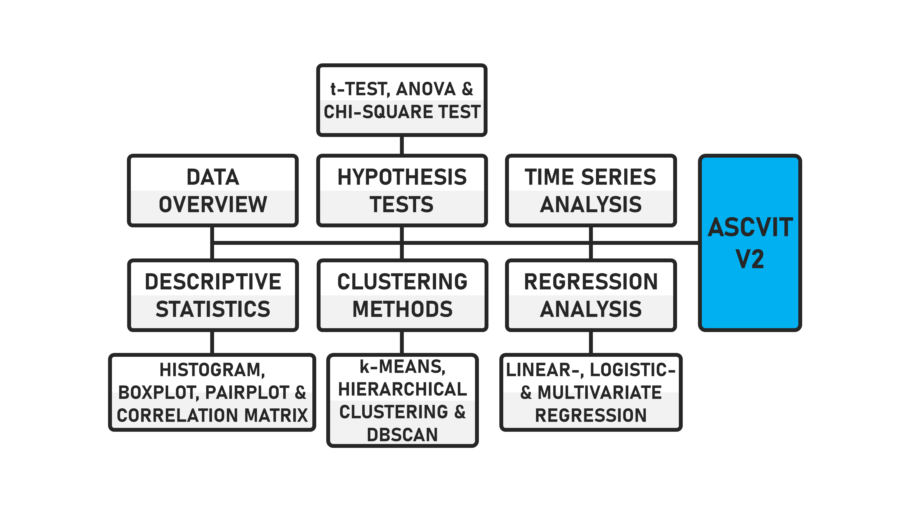

# ASCVIT V2 APP
## Automatic Statistical Calculation, Visualization, and Interpretation Tool

This repository, developed by Stefan Pietrusky, is based on the article published at Towards Data Science [[1]](https://medium.com/towards-data-science/ascvit-v1-automatic-statistical-calculation-visualization-and-interpretation-tool-aa910001a3a7). In this article, I discuss the development of a first version (V1) of a local app that can be used to automatically apply various statistical methods to any datasets. The enhanced version of ASCVIT (V1.5) now includes automatic interpretation of all generated visualisations [appv1.5.py]. The latest version of ASCVIT is now available [appv2.py]. Streamlit is no longer used in this version. The app is completely based on customizable HTML, CSS and JS. An LLM defined via the code is no longer used, but the models installed locally via Ollama can be selected as required. The navigation has been adapted and all data visualizations are now interactive through Plotly.

ASCVIT can be used in social work, specifically in associations and organizations that collect a wide range of data and can use the tool to evaluate it in order to better understand financial needs [[2]](https://www.pedocs.de/frontdoor.php?source_opus=33234). This is an open source project for educational and research purposes.



> **⚠️ Work in Progress:** This prototyp is currently under active development. While I make it available for research purposes, please be aware that there will be some changes to the functional structure. I recognize that some current technical design decisions may not be optimal and are subject to revision. Researchers using this prototyp should expect potential updates and changes. I recommend checking back regularly for updates and versioning information.

## Overview of the statistical procedures 
The following statistical procedures are supported by the first Version:


## Structure and function of ASCVIT [V1.5]
The code to run the app is already in the repository as well as a script (clean.py) to remove missing values from data records. Below is a short GIF showing the structure and function of the app.


## The latest version of ASCVIT [V2]
The new version of ASCVIT looks as follows.


## Installing and running the application 
1. Clone this repository on your local computer: 
```bash 
git clone https://github.com/stefanpietrusky/ascvitv2.git
```
2. Install the required dependencies:
```bash 
pip install -r requirements.txt
```
3. Install Ollama and load the model [Llama3.1](https://ollama.com/library/llama3.1) (8B) or another.
4. Remove missing data, if available, with the clean.py script
```bash 
python clean.py
```
5. If you use V1.5 start the Streamlit app:
```bash 
streamlit run appv1.5.py
```
6. If you use V2 start app with:
```bash 
python appv2.py
```
7. Use the file [data.csv](https://github.com/stefanpietrusky/ASCVIT/blob/main/data.csv) to test the application.

## References
[1] Pietrusky, S. (2024). ASCVIT V1: Automatic Statistical Calculation, Visualization, and Interpretation Tool. Towards Data Science

[2] Pietrusky, S. (2025). Datafizierung und KI in der Sozialen Arbeit: Automatisierte Auswertung, Visualisierung und Interpretation von Daten zur Optimierung von Prozessen. peDOCs.
